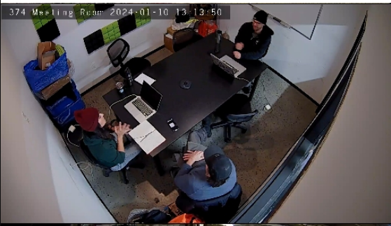
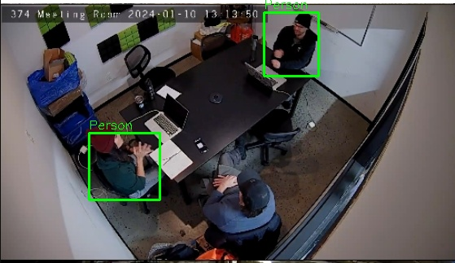

# shipboard-malware-example

This is an example of how shipboard malware can be generated by an attacker. This code is intended to be run with `https://github.com/CRACK-MCR/MaCySTe`

== Steps to compile

Step 1: `cd` into the shared-object-code directory

Step 2: Run `mkdir build`

Step 3: Run 

```bash
cd build && cmake ..
```

Step 4: Generate the shared object file

```bash
make
```

Step5: Move the generated `libpeoplecounter.so` file to the project's root directory

```bash
mv libpeoplecounter.so ../../
```

Step 6: Run the Java command inside the project's root directory:

```bash
mvn clean package
```

Step 7: Start a test modbus server

```bash
docker pull oitc/modbus-server
docker run --name modbus-server -p 5020:5020 -d oitc/modbus-server
```

Step 8: Now run the command:

```bash
java -Djava.library.path=. -cp target/modbus-client-1.0-SNAPSHOT.jar:. com.example.modbus.ModbusClientExample
```

=== Expected Output

Say the input to the model is:



The expected output is:



The malware can then take a decisions regarding what action to perform.
This is non-deterministic, and as shown doesn't work 100% of the time.
But, this is good enough for this use case.

=== Things to improve upon:

This malware currently requires the YOLO model files located within the `models/` directory to perform any action.
It also requires libraries to be installed on the target machine before the shared object file can run.
While I have some rough ideas of things that could work to overcome these problems, I haven't had a chance to solve them.


